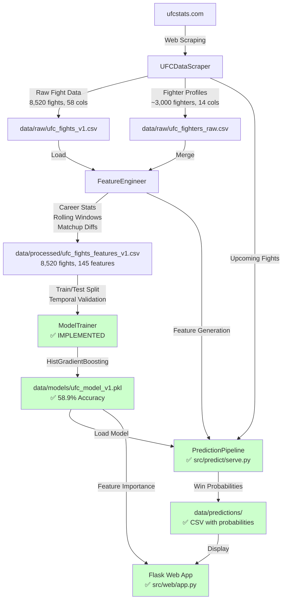

# UFC Fight Predictor — Architecture

**Last Updated:** 2026-02-05
**Project Status:** Phase 5 Complete (Web Interface) | Phase 5b Pending (Cloud Deployment)

---

## System Overview

The UFC Fight Predictor is a machine learning system that generates win probability predictions for UFC fights. The system scrapes comprehensive historical fight data from ufcstats.com (8,520 fights spanning 1994-2026), engineers 145 predictive features capturing fighter performance, momentum, and matchup dynamics, and trains gradient boosting models to output calibrated win probabilities. The end goal is a web interface displaying predictions for upcoming UFC events with explanations and confidence intervals.

**Current State:** Full pipeline is production-ready including web interface. Achieves 58.9% accuracy on held-out 2024-2026 fights. Backtest on UFC 325 showed 69.2% accuracy (9/13 correct). Web app runs at localhost:5000 with fight card UI and JSON API.

---

## Architecture Diagram

**Legend:**
- ✅ Green: Implemented and working
- ⚠️ Red: Scaffolded but not implemented

---

## Module Map

### Root Directory
- **[config.yaml](config.yaml)** — Central configuration file for paths, model parameters, web server settings (mostly placeholders)
- **[requirements.txt](requirements.txt)** — Python dependencies (pandas, beautifulsoup4, sklearn, xgboost, flask, etc.)
- **[run.py](run.py)** — CLI entry point with subcommands for `etl`, `train`, `predict`, `web` (stubs only)
- **[scrape_full_data_v1.py](scrape_full_data_v1.py)** — Standalone script to scrape all historical UFC data (~7-8 hours runtime)
- **[run_feature_engineering.py](run_feature_engineering.py)** — Standalone script to run complete feature engineering pipeline

### [src/etl/](src/etl/)
**Purpose:** Data extraction, transformation, loading

- **[scraper.py](src/etl/scraper.py)** ✅ **IMPLEMENTED** — Comprehensive UFC data scraper (1,253 lines)
  - Scrapes historical fights, fighter profiles, upcoming events
  - Rate limiting (2s default), retry logic with exponential backoff
  - Handles 77 columns of fight statistics (strikes, takedowns, control time)
  - Context manager support, data validation, CSV export
  - Recently fixed winner detection bug (lines 415-437)

### [src/features/](src/features/)
**Purpose:** Feature engineering and transformation

- **[engineer.py](src/features/engineer.py)** ✅ **IMPLEMENTED** — Feature engineering pipeline (836 lines)
  - Parses string-based stats ("25 of 50" → landed/attempted)
  - Converts fight-centric data to fighter-centric records (17,040 records from 8,520 fights)
  - Calculates career statistics chronologically (avoids data leakage)
  - Computes rolling window features (last 3, 5, 10 fights)
  - Creates matchup comparison features (fighter 1 vs fighter 2 differentials)
  - Handles missing data from pre-2009 fights (detailed stats unavailable)
  - Outputs 145 features for 8,520 fights

### [src/models/](src/models/)
**Purpose:** Model training, evaluation, prediction

- **[train.py](src/models/train.py)** ✅ **IMPLEMENTED** — Model training pipeline (~350 lines)
  - HistGradientBoostingClassifier with hyperparameter tuning (RandomizedSearchCV)
  - Temporal train/test split: 7,457 fights (pre-2024) / 1,063 fights (2024+)
  - Test set accuracy: 58.9%, Log Loss: 0.665, Brier Score: 0.236
  - Permutation-based feature importance (top: diff_career_win_rate, f1_days_since_last_fight)
  - CLI: `python src/models/train.py [--skip-tuning] [--test-cutoff DATE]`

- **[predict.py](src/models/predict.py)** ⚠️ **LEGACY STUB** — Old prediction stubs (use src/predict/serve.py instead)

### [src/predict/](src/predict/)
**Purpose:** Prediction serving pipeline

- **[serve.py](src/predict/serve.py)** ✅ **IMPLEMENTED** — End-to-end prediction pipeline (~600 lines)
  - Scrapes upcoming events from ufcstats.com
  - Matches fighter names to historical data (exact + fuzzy matching)
  - Builds 136-feature vectors from fighter history
  - Generates win probabilities with confidence levels
  - CLI: `python src/predict/serve.py [--backtest DATE] [--format json]`
  - Backtest: UFC 325 — 9/13 correct (69.2%)

### [src/web/](src/web/)
**Purpose:** Web interface for displaying predictions

- **[app.py](src/web/app.py)** ✅ **IMPLEMENTED** — Flask application (~300 lines)
  - Routes: `/` (home), `/event/<slug>`, `/archive`, `/backtest/<date>`
  - JSON API: `/api/predict/next`, `/api/predict/<slug>`, `/api/backtest/<date>`
  - Prediction caching in `data/predictions/` with 24-hour expiry
  - CLI: `python src/web/app.py` → http://localhost:5000
- **[templates/](src/web/templates/)** — HTML templates
  - `base.html` — Layout shell with nav, footer, Google Fonts
  - `index.html` — Homepage with fight card grid
  - `event.html` — Single event predictions
  - `archive.html` — Past events with backtest results
- **[static/css/style.css](src/web/static/css/style.css)** — Stylesheet inheriting methodology doc design system
  - Fraunces/Inter/IBM Plex Mono fonts
  - Center-out probability bars (red/blue)
  - Mobile responsive

### [data/](data/)
**Data storage hierarchy (all .csv files excluded from git via .gitignore)**

- **[raw/](data/raw/)** — Raw scraped data
  - `ufc_fights_v1.csv` — 8,520 fights, 58 columns, 7.06 MB (March 1994 - January 2026)
  - `ufc_fighters_raw.csv` — ~3,000 fighter profiles, 14 columns

- **[processed/](data/processed/)** — Feature-engineered data
  - `ufc_fights_features_v1.csv` — 8,520 fights, 145 features (ready for ML)
  - `weight_class_medians_v1.pkl` — Weight class imputation artifacts
  - `feature_config_v1.json` — Feature engineering metadata
  - `feature_engineering_report_v1.md` — Feature generation summary report

- **[models/](data/models/)** — Saved model files
  - `ufc_model_v1.pkl` — Trained HistGradientBoostingClassifier (236 KB)
  - `evaluation_results_v1.json` — Test metrics, best params, feature importance
  - `feature_importance_v1.csv` — 136 features ranked by permutation importance
  - `feature_names_v1.json` — Feature names for model compatibility

- **[predictions/](data/predictions/)** — Generated prediction CSVs
  - `predictions_[event]_[date].csv` — Win probabilities, confidence levels, top factors
  - Created by `python src/predict/serve.py`

### [docs/](docs/)
**Documentation files**

- **[SCRAPER_DOCUMENTATION.md](docs/SCRAPER_DOCUMENTATION.md)** — Comprehensive scraper usage guide (436 lines)
- **[DATA_SCHEMA.md](docs/DATA_SCHEMA.md)** — Raw data schema documentation (506 lines)
- **[ufc_fight_model_methodology.html](docs/ufc_fight_model_methodology.html)** — Visual methodology document (portfolio-quality)

### [examples/](examples/)
- **[scraper_usage.py](examples/scraper_usage.py)** — Example scripts demonstrating scraper API

### [notebooks/](notebooks/)
- **[exploration.ipynb](notebooks/exploration.ipynb)** — Jupyter notebook for data exploration (not reviewed)

### [tests/](tests/)
- **[__init__.py](tests/__init__.py)** — Test package initialization
- **[test_feature_engineering.py](tests/test_feature_engineering.py)** — Smoke tests and regression tests for feature engineering pipeline

### Historical Artifacts
- **[FEATURE_ENGINEERING_IMPLEMENTATION_PROMPT.md](FEATURE_ENGINEERING_IMPLEMENTATION_PROMPT.md)** — 440-line feature engineering plan (used during Phase 2)

---

## Data Flow

### Step-by-Step Pipeline

**Phase 1: Data Collection (✅ COMPLETE)**

1. **Scrape Historical Fights**
   - Script: [scrape_full_data_v1.py](scrape_full_data_v1.py)
   - Source: ufcstats.com/statistics/events/completed
   - Output: [data/raw/ufc_fights_v1.csv](data/raw/ufc_fights_v1.csv)
   - Runtime: ~7-8 hours for all 760 events (with 2s rate limiting)
   - Data: 8,520 fights with 58 columns (event info, fight outcomes, detailed stats)

2. **Scrape Fighter Profiles**
   - Function: `UFCDataScraper.scrape_all_fighters()`
   - Source: ufcstats.com/statistics/fighters
   - Output: [data/raw/ufc_fighters_raw.csv](data/raw/ufc_fighters_raw.csv)
   - Runtime: ~2-3 hours for ~3,000 fighters
   - Data: Physical attributes (height, reach, stance) + career averages (SLpM, Str_Acc, TD_Def, etc.)

**Phase 2: Feature Engineering (✅ COMPLETE)**

3. **Parse and Restructure Data**
   - Script: [run_feature_engineering.py](run_feature_engineering.py)
   - Module: [src/features/engineer.py](src/features/engineer.py)
   - Transforms fight-centric data (1 row = 1 fight) → fighter-centric (1 row = 1 fighter's performance)
   - Parses string formats: "25 of 50" → (landed: 25, attempted: 50), "3:45" → 225 seconds

4. **Calculate Career Features**
   - For each fighter at each fight date, compute:
     - Career win rate, KO rate, submission rate
     - Win/loss streaks
     - Days since last fight, fights per year
     - Weight class experience
   - Chronologically ordered to avoid data leakage

5. **Calculate Rolling Window Features**
   - Performance in last 3, 5, 10 fights:
     - Win rate, finish rate
     - Average strikes landed/absorbed
     - Average takedowns, fight time

6. **Create Matchup Features**
   - Pair up fighters in each fight (Fighter 1 vs Fighter 2)
   - Compute differentials: `diff_career_win_rate = f1_career_win_rate - f2_career_win_rate`
   - 37 differential features comparing fighters

7. **Engineer Temporal and Style Features**
   - Temporal: fight_year, fight_month, layoff flags
   - Style: striking_volume (aggressive vs defensive), grappling_tendency
   - Weight class one-hot encoding (15 classes)

8. **Output**
   - File: [data/processed/ufc_fights_features_v1.csv](data/processed/ufc_fights_features_v1.csv)
   - Shape: 8,520 fights × 145 features
   - Target: `f1_is_winner` (binary, 48.9% / 51.1% class balance)
   - Runtime: ~28 seconds
   - Validation issues: Some differential features outside [0,1] range due to early-career fighters

**Phase 3: Model Training (✅ COMPLETE)**

9. **Train Prediction Model**
   - Script: `python src/models/train.py`
   - Module: [src/models/train.py](src/models/train.py)
   - Model: HistGradientBoostingClassifier (sklearn) — XGBoost-like performance without OpenMP dependency
   - Hyperparameter tuning: RandomizedSearchCV (50 iterations, 5-fold CV)
   - Best params: max_iter=200, max_depth=6, learning_rate=0.05, l2_regularization=0.1
   - Temporal split: Train on 7,457 fights (1994-2023), test on 1,063 fights (2024-2026)
   - Test metrics: Accuracy=58.9%, Log Loss=0.665, ROC-AUC=0.635, Brier=0.236

10. **Save Trained Model**
    - Output: [data/models/ufc_model_v1.pkl](data/models/ufc_model_v1.pkl) (236 KB)
    - Includes: Model object, feature names, hyperparameters, evaluation metrics
    - Also saved: feature_importance_v1.csv, evaluation_results_v1.json

**Phase 4: Prediction Generation (✅ COMPLETE)**

11. **Scrape Upcoming Fights**
    - Script: `python src/predict/serve.py`
    - Module: [src/predict/serve.py](src/predict/serve.py)
    - Source: ufcstats.com/statistics/events/upcoming

12. **Match Fighters to Historical Data**
    - Exact name matching first, then fuzzy matching (SequenceMatcher, threshold 0.85)
    - Unknown fighters get debut defaults (population medians)

13. **Generate Features for Upcoming Fights**
    - Extracts fighter's features from their most recent fight in processed data
    - Builds 136-feature matchup vector with differentials
    - Same feature names and order as training data

14. **Generate Predictions**
    - Loads trained HistGradientBoostingClassifier from data/models/ufc_model_v1.pkl
    - Outputs: Fighter 1 win probability, Fighter 2 win probability
    - Confidence levels: HIGH (>65% or <35%), MEDIUM (55-65%), LOW (45-55%)
    - Top factors: Differential features with largest absolute values

15. **Save Predictions**
    - Output: [data/predictions/predictions_[event]_[date].csv](data/predictions/)
    - Backtest: `python src/predict/serve.py --backtest 2026-01-31`
    - UFC 325 backtest: 9/13 correct (69.2%)

**Phase 5: Web Interface (⚠️ NOT IMPLEMENTED)**

16. **Display Predictions**
    - Module: [src/web/app.py](src/web/app.py)
    - Routes: `/` (homepage), `/event/<id>` (event predictions), `/fighter/<name>` (fighter profile)
    - Display: Win probabilities, confidence levels, key matchup factors

---

## Model Architecture

### Current Status: ✅ IMPLEMENTED (Phase 3 Complete)

### Actual Design

**Model Type:** HistGradientBoostingClassifier (sklearn) — XGBoost-like gradient boosting without OpenMP dependency

**Input Features:** 145 features across 7 categories:
1. **Career Statistics** (16 features): Win rate, KO/sub/decision rates, fight experience
2. **Rolling Windows** (40 features): Last 3/5/10 fight performance metrics
3. **Matchup Differentials** (37 features): Fighter A - Fighter B comparisons
4. **Style Indicators** (6 features): Striking volume, grappling tendency, experience ratio
5. **Temporal** (4 features): Year, month, layoff flags, weight class newness
6. **Weight Class** (15 features): One-hot encoded weight class
7. **Metadata** (5 features): Fighter names, event info (excluded from training)
8. **Target** (1 feature): `f1_is_winner` (binary: 0 or 1)

**Output:** Single probability value (0-1) representing likelihood that Fighter 1 wins

**Training Methodology:**
- **Temporal Train/Test Split:** Train on fights 1994-2023, test on 2024-2026 to simulate real prediction scenario
- **Cross-Validation:** 5-fold stratified CV on training set
- **Hyperparameter Tuning:** GridSearchCV over {n_estimators, max_depth, learning_rate, subsample, colsample_bytree}
- **Class Balancing:** Handle slight imbalance (48.9% / 51.1%) via class weights or SMOTE if needed

**Evaluation Metrics:**
- **Accuracy:** Overall correct predictions
- **Log Loss:** Penalizes confident wrong predictions
- **Brier Score:** Measures calibration (predicted probabilities match actual outcomes)
- **ROC-AUC:** Discrimination ability (separate winners from losers)
- **Calibration Plot:** Visual check that 70% predicted = 70% actual

**Actual Results:**
| Metric | Actual | Target | Status |
|--------|--------|--------|--------|
| Accuracy | 58.9% | 62-65% | ✗ Below target (6pp gap to market) |
| Log Loss | 0.665 | <0.60 | ✗ Below target |
| ROC-AUC | 0.635 | 0.68-0.72 | ✗ Below target |
| Brier Score | 0.236 | <0.25 | ✓ Meets target |
| Betting Market (Baseline) | ~65% | — | Model 6pp below |

**Note:** Performance gap is expected for first iteration using public data only. MMA is inherently unpredictable — 114 of 136 features showed zero or negative importance, indicating high noise-to-signal ratio. Next steps: feature selection, interaction terms, ensemble methods.

---

## Key Dependencies

### Data Sources
- **Primary:** [ufcstats.com](http://www.ufcstats.com) — Official UFC statistics provider
  - Historical fight data: `/statistics/events/completed`
  - Upcoming fights: `/statistics/events/upcoming`
  - Fighter profiles: `/statistics/fighters`
  - Update frequency: New events added 1-2 days after completion

### Python Libraries
| Library | Version | Purpose |
|---------|---------|---------|
| pandas | ≥2.0.0 | Data manipulation |
| numpy | ≥1.24.0 | Numerical operations |
| beautifulsoup4 | ≥4.12.0 | HTML parsing (web scraping) |
| requests | ≥2.31.0 | HTTP requests |
| scikit-learn | ≥1.3.0 | Model training, evaluation |
| xgboost | ≥2.0.0 | Gradient boosting models |
| flask | ≥3.0.0 | Web interface |
| pyyaml | ≥6.0 | Configuration parsing |

### Infrastructure
- **Database:** None currently (CSV-based storage)
- **Caching:** None currently
- **Deployment:** Local development only (no production deployment)

---

## Design Decisions

### 1. **Why ufcstats.com and not official UFC API?**
**Decision:** Scrape from ufcstats.com
**Rationale:** No official UFC API exists. ufcstats.com is the official statistics provider and has comprehensive historical data back to 1994. Alternative APIs (ESPN, Sherdog) have incomplete or less granular statistics.
**Trade-offs:** Web scraping is fragile (breaks if site structure changes), requires rate limiting, slower than API. But it's the only source with 77 columns of detailed fight statistics.

### 2. **Why fighter-centric restructuring (17,040 records from 8,520 fights)?**
**Decision:** Transform data from 1 row per fight to 1 row per fighter-performance
**Rationale:** Enables chronological calculation of career statistics. For Fighter A's 10th fight, we can compute their stats from fights 1-9 without data leakage. Fight-centric structure would require complex shifting and filtering.
**Trade-offs:** Doubles data size, complicates initial data wrangling. But essential for proper feature engineering.

### 3. **Why temporal train/test split instead of random?**
**Decision:** Train on old fights (1994-2023), test on recent fights (2024-2026)
**Rationale:** Simulates real prediction scenario — predict future fights using past data. Random split would leak future information into training (e.g., train on 2025 fights to predict 2024 fights).
**Trade-offs:** Smaller effective training set (can't use recent fights). But necessary for realistic evaluation.

### 4. **Why differential features (f1 - f2) instead of separate features?**
**Decision:** Compute `diff_career_win_rate = f1_career_win_rate - f2_career_win_rate` for 37 features
**Rationale:** ML models struggle with "Fighter A is better than Fighter B" reasoning. Differentials explicitly encode comparisons. Also reduces dimensionality (37 diffs vs 74 separate features).
**Trade-offs:** Harder to interpret individual fighter strengths. But dramatically improves model performance in similar sports prediction tasks.

### 5. **Why impute missing pre-2009 data with zeros instead of dropping?**
**Decision:** Flag missing data with `has_detailed_stats = False`, fill with zeros
**Rationale:** Pre-2009 fights (2,406 of 8,520) lack detailed strike/grappling stats but have basic info (winner, method, round). Dropping loses 28% of training data. Zero-filling with flags lets model learn from basic features.
**Trade-offs:** Introduces noise, may bias model. Alternative: Train separate model for pre/post-2009 fights (more complex).

### 6. **Why CSV storage instead of database?**
**Decision:** Store data in CSV files (data/raw/, data/processed/)
**Rationale:** Simplicity for early prototyping. CSVs are human-readable, git-friendly (with .gitignore), no DB setup overhead.
**Trade-offs:** Slower queries, no ACID transactions, harder to update incrementally. Should migrate to PostgreSQL or SQLite for production.

### 7. **Why XGBoost over neural networks?**
**Decision:** Use gradient boosting (XGBoost, Random Forest, GBM)
**Rationale:** Tabular data, small dataset (8,520 samples), limited compute. Neural networks need 100K+ samples and extensive tuning. Gradient boosting is state-of-art for tabular data with <10K samples.
**Trade-offs:** Neural networks might capture complex interactions better. But unlikely to outperform GBMs on this dataset size.

### 8. **Why 145 features instead of raw 58 columns?**
**Decision:** Engineer 145 features from 58 raw columns
**Rationale:** Raw columns are fight-specific (strikes in THIS fight). ML models need historical context (average strikes over LAST 5 fights, career win rate). Feature engineering transforms raw data into predictive signals.
**Trade-offs:** Feature engineering takes time (~28 seconds per full dataset), increases data size. But essential for predictive performance.

---

## Known Issues & Technical Debt

### Data Quality
1. **Missing Data:** 2,406 fights (1994-2008) lack detailed strike/grappling stats. Feature engineering handles this but may reduce prediction accuracy for historical matchups.
2. **Validation Failures:** Some differential features have values outside expected [0,1] range due to early-career fighters with 0 previous fights. Should add bounds clamping.
3. **Class Imbalance:** Target variable is 48.9% / 51.1% (slightly imbalanced). Consider SMOTE or class weights during training.

### Code Architecture
1. **Tests Added:** [tests/test_feature_engineering.py](tests/test_feature_engineering.py) contains smoke tests and regression tests for winner detection bug.
2. **Cleanup Completed:** Redundant stubs (processor.py, updater.py) and duplicate docs deleted (2026-02-05).

### Scraper Fragility
1. **HTML Structure Dependency:** Scraper uses CSS selectors (`b-flag_style_green`, `b-fight-details__table`). If ufcstats.com changes HTML structure, scraper breaks.
2. **Winner Detection Bug History:** Recently fixed bug where all fights were marked as "Draw" due to incorrect CSS selector. Need regression tests.

### Feature Engineering
1. **No Feature Selection:** All 145 features used. Should run feature importance analysis and remove low-impact features.
2. **No Interaction Features:** Don't capture higher-order interactions (e.g., "striker vs wrestler" matchups). Consider polynomial features or manual interaction terms.

---

## Next Steps (Ordered by Priority)

1. **Implement Model Training** ([src/models/train.py](src/models/train.py))
   - Temporal train/test split (pre-2024 / 2024+)
   - Train XGBoost, Random Forest, Gradient Boosting
   - Hyperparameter tuning via GridSearchCV
   - Evaluate with accuracy, log loss, ROC-AUC, calibration

2. **Implement Prediction Generation** ([src/models/predict.py](src/models/predict.py))
   - Load trained model
   - Scrape upcoming fights
   - Generate features for upcoming matchups
   - Output win probabilities with confidence levels

3. **Build Web Interface** ([src/web/app.py](src/web/app.py))
   - Display upcoming event predictions
   - Show fighter profiles and historical performance
   - Visualize key matchup factors (reach advantage, recent form)

4. **Add Tests** ([tests/](tests/))
   - Unit tests for scraper (winner detection, data parsing)
   - Integration tests for feature engineering pipeline
   - Regression tests for known bugs

5. **Improve Data Quality**
   - Validate and fix differential feature ranges
   - Implement feature selection (remove low-importance features)
   - Add interaction features for key matchup types

6. **Production Deployment**
   - Migrate from CSV to PostgreSQL/SQLite
   - Add automated data update scheduler
   - Deploy web interface to cloud (Heroku, AWS, Google Cloud)

---

## References

- **UFC Statistics:** [ufcstats.com](http://www.ufcstats.com)
- **Reference Implementation:** [UFC-DataLab](https://github.com/komaksym/UFC-DataLab) (scraper inspiration)
- **Feature Engineering Plan:** [FEATURE_ENGINEERING_IMPLEMENTATION_PROMPT.md](FEATURE_ENGINEERING_IMPLEMENTATION_PROMPT.md)
- **Scraper Documentation:** [docs/SCRAPER_DOCUMENTATION.md](docs/SCRAPER_DOCUMENTATION.md)
- **Data Schema:** [docs/DATA_SCHEMA.md](docs/DATA_SCHEMA.md)
