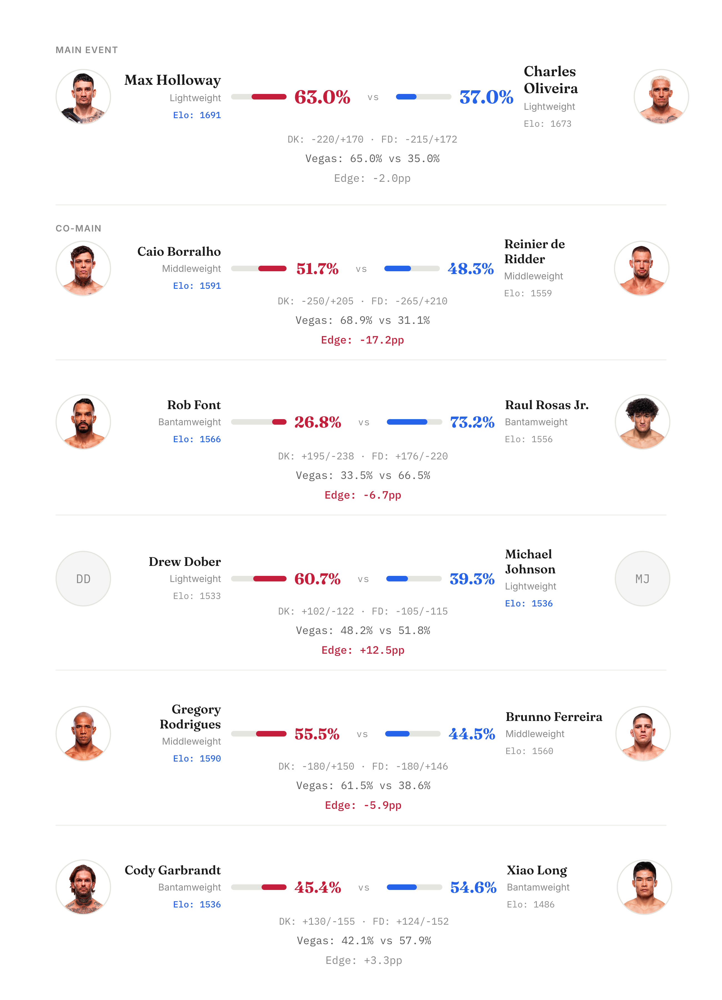
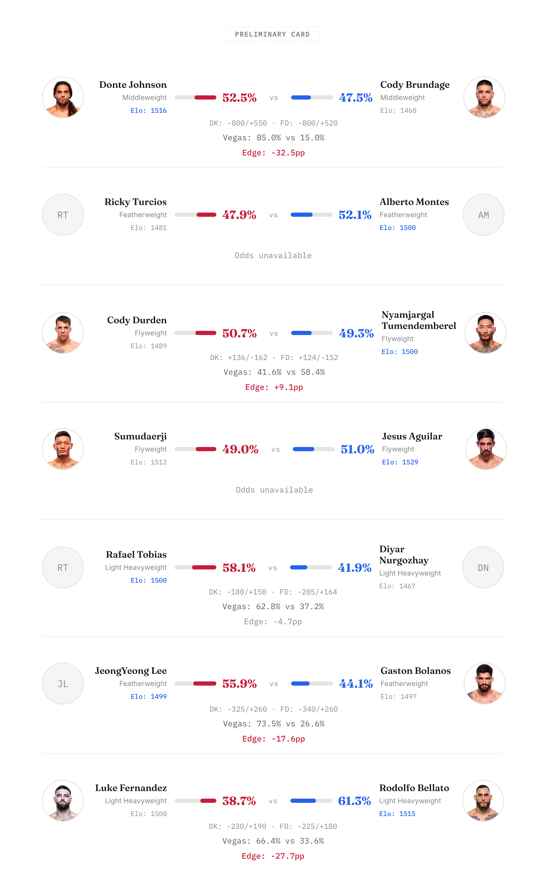

# UFC 326: Holloway vs. Oliveira 2

*Phase 9.2 model probabilities — March 7, 2026*

---

Las Vegas card with 13 fights and 4 positive edges. The model mostly agrees with Vegas on this one — it likes the same favorites in 9 of 11 fights with odds. Running accuracy: 108/138 (78.3%) across 11 tracked events.

## Main Card

## Preliminary Card

---

## Three Fights Worth Watching

**Main Event: Holloway vs Oliveira**

The model gives Holloway 63.0%, Vegas has him at 65.0%. Near-perfect agreement. Holloway has the higher Elo (1691 vs 1673, +18 differential) and has fought 5 fewer career fights than Oliveira but at the same weight class. The main drag on Holloway: an 84-day longer layoff and a 5-inch reach disadvantage. At -220, the model sees no edge here — this is one of those rare fights where the price looks about right.

**Biggest Edge: Bellato (+27.7pp vs Vegas)**

Vegas has Fernandez as a -230 favorite at 66.4%. The model flips it to Bellato at 61.3%. The reason: Luke Fernandez has zero UFC fights in the model's historical data. He's a ghost fighter — default Elo (1500), no career stats, pure debut defaults. Bellato has a small Elo edge (1515 vs 1500), 3 more UFC fights, and a 2-fight win streak. When the model is predicting against a fighter it literally has no data on, and Vegas has that fighter as a -230 favorite, Vegas probably knows something the model doesn't.

**Second Biggest Edge: Dober (+12.5pp vs Vegas)**

Vegas prices this as a coin flip (Dober 48.2%, Johnson 51.8%). The model sees Dober at 60.7%. The driver: Michael Johnson is on a 3-fight loss streak with negative Elo momentum (-34.7), while Dober fought 91 days more recently. Their Elos are nearly identical (1533 vs 1536), so the model is betting on activity and momentum over raw skill. At +102 on DraftKings, Dober looks like genuine value if you trust the model's activity weighting.

---

Results recap after the event.
