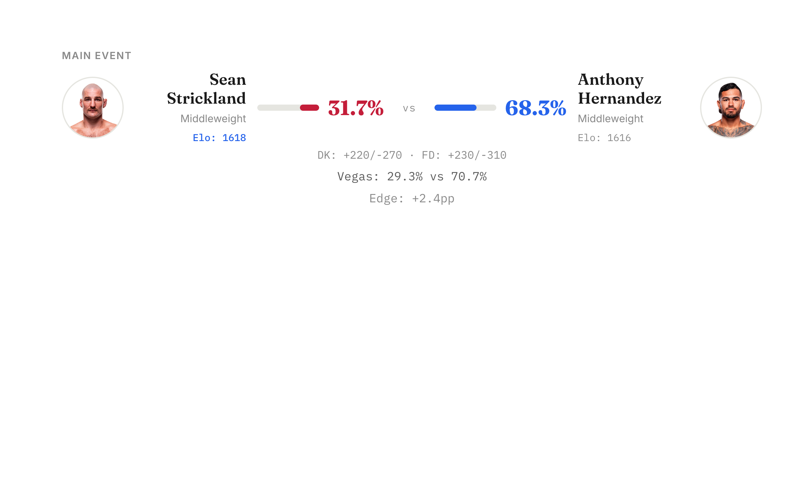
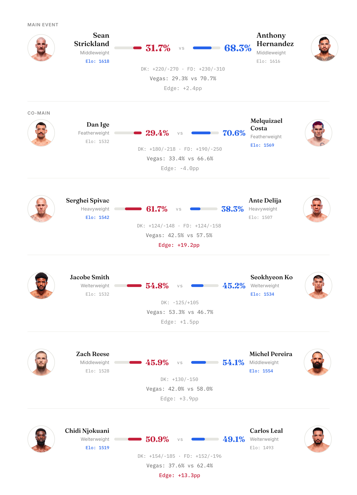
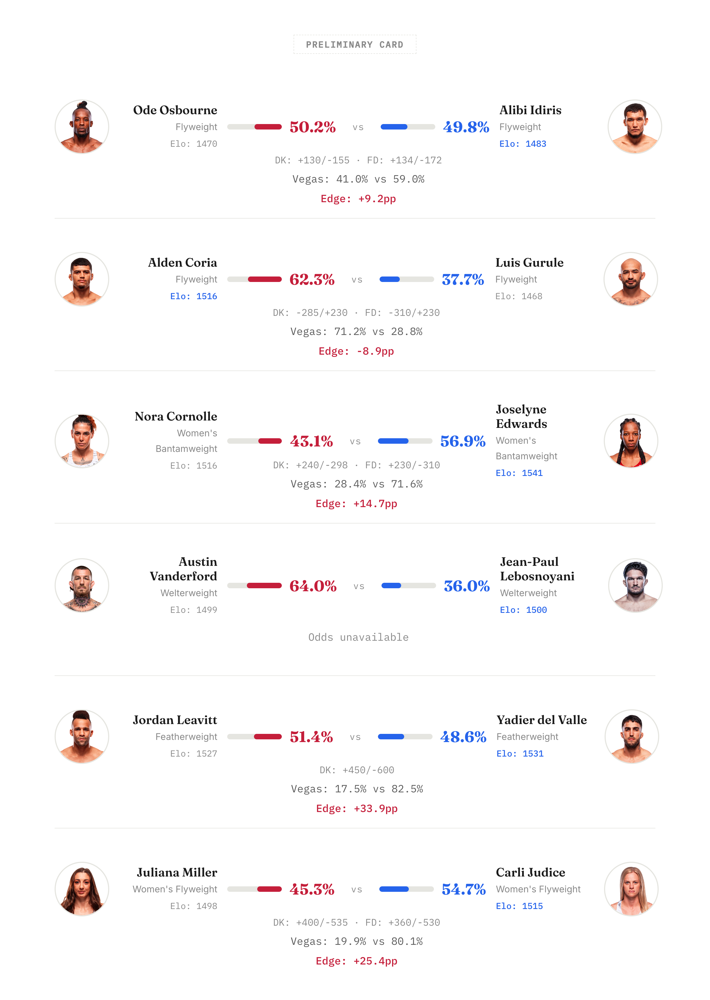

# UFC Fight Night: Strickland vs. Hernandez

*Phase 9.2 model probabilities — February 21, 2026*

---

First card from The Octagon Quant. Model probabilities for every fight, Vegas odds comparison, and value edges. 62.9% accuracy across 129 tracked fights.

---

## Three Fights Worth Watching

**Main Event: Strickland vs Hernandez**

The model gives Hernandez 68.3% — a former champion as an underdog in his own headliner. What's driving it: Hernandez is on a 6-fight win streak (diff_win_streak: -6) and his Elo momentum is +36 points better than Strickland's. Strickland hasn't fought in 182 days. The model might be wrong here — it doesn't see championship experience, and both fighters have nearly identical Elos (1618 vs 1616). This prediction is almost entirely momentum and activity.

**Biggest Edge: Vanderford (+27.7pp vs Vegas)**

Vegas has Lebosnoyani as a -198 favorite. The model flips it — 64% Vanderford. The Elos are dead even (1499 vs 1500), so this isn't a talent gap call. Vanderford is 4 years younger and fought 225 days more recently. Vegas might be overreacting to Lebosnoyani's UFC debut win. Or the model is missing something about Lebosnoyani's skillset that doesn't show up in historical stats.

**Second Biggest Edge: Miller (+25.4pp vs Vegas)**

Vegas has Judice at 80.1% implied. The model says 54.7%. Judice has better Elo momentum (+32 points) and a slight Elo edge (+17 points), but the model thinks that's nowhere near an 80/20 fight. Miller is on a 2-fight losing streak, which explains the market's skepticism. The model doesn't see a blowout — it sees a competitive fight where Miller is priced like she has no chance.

---

Results recap after the event.
